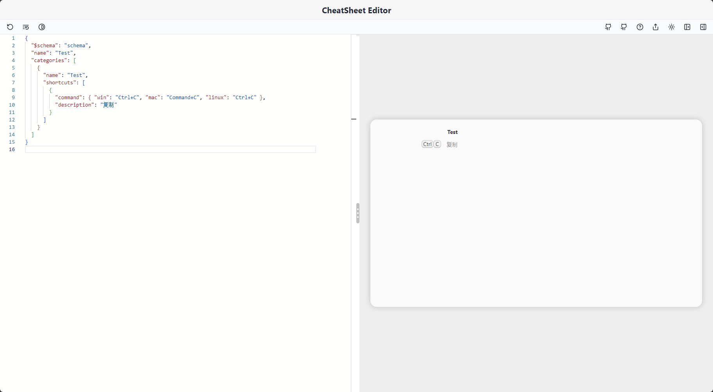
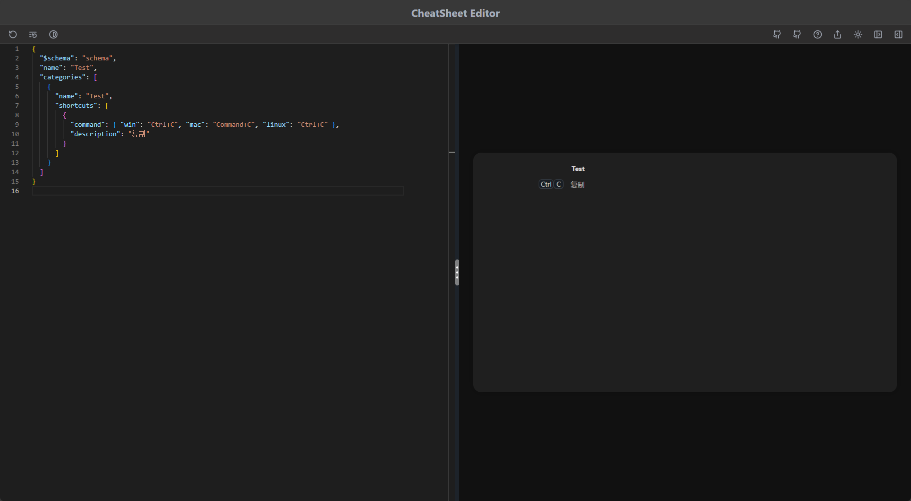

<div align="center">


### CheatSheet Editor

<b>🎉 用于 CheatSheet 的应用快捷键可视化编辑器</b>


<br/>


&nbsp

</div>

# 👋 目录

- [👋 目录](#-目录)
- [⚡️ 基本功能](#️-基本功能)
  - [编辑区](#编辑区)
  - [预览区](#预览区)
- [🤝 手动编译](#-手动编译)
  - [环境要求](#环境要求)
  - [开始编译](#开始编译)

# ⚡️ 基本功能

## 编辑区

- 默认配置
- 默认案例
- 编辑器主题

## 预览区

- 导出配置文件
- 主题
- 仅编辑区
- 仅预览区

# 🤝 手动编译

## 环境要求

- Node.js >= 18.0.0
- pnpm >= 8.5.0

## 开始编译

1. Clone 仓库

   ```bash
   git clone https://github.com/JinSooo/CheatSheet-Editor.git
   ```

2. 安装依赖

   ```bash
   cd CheatSheet-Editor
   pnpm install
   ```

3. 开发调试

   ```bash
   pnpm dev # Run the app in development mode
   ```

4. 打包构建

   ```bash
   pnpm build # Build into installation package
   ```
